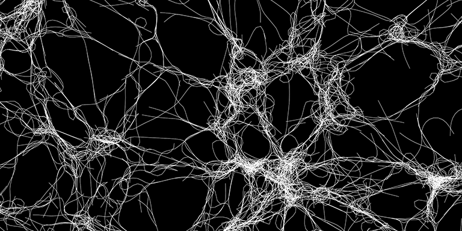
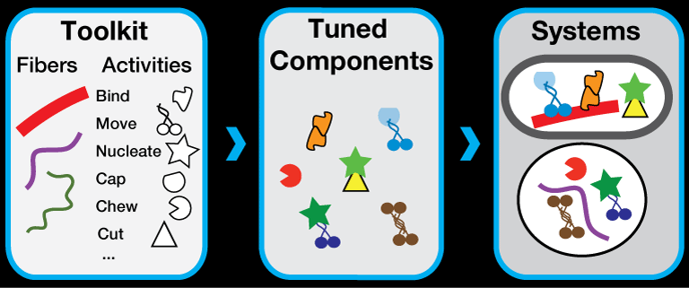

# Cytosim

Cytosim is a cytoskeleton simulation designed to handle large systems of flexible filaments with associated proteins such as molecular motors. It is a versatile base that has been used to study actin and microtubule systems in 1D, 2D and 3D. It is built around a core cross-platform C++ engine. It runs on UNIX, Mac OSX, GNU/Linux and within Cygwin on Windows. The code is modular and extensible, making Cytosim a convenient base that can be customized to meet particular tasks.

Cytosim is a suite of command-line tools with simulation and display capabilities. The simulation is specified in a [configuration file](doc/sim/config.md), defining objects, their parameters and a suite of operations, such as advancing time, saving frames or [generating reports](doc/sim/report.md). Here is a basic example:

    set simul system
    {
        time_step = 0.005
        viscosity = 0.02
    }

    set space cell
    {
        shape = sphere
        dimensions = 5
    }

    set fiber microtubule
    {
        rigidity = 20
        segmentation = 0.5
        confine = inside, 200, cell
    }
        
    new cell

    new 5 microtubule
    {
        length = 11
    }

    run 5000 system
    {
        nb_frames = 10
    }

The parameters are specified in [units of second, micrometers and pico-Newtons](doc/sim/units.md).

# Overview

Cytosim can handle systems of filaments with associated proteins such as molecular motors. 
Filaments are represented by linear strings of points (`fibers`) that can bend but are incompressible and inextensible along their axis. Cytosim can also simulate `beads`, `spheres` and `solids` which are also build from points, but not in linear arragements.
 
Objects can be connected by Hookean springs, with few restrictions on the topology of the connections:

* The attachment points on the fibers can be located anywhere along their length, and in this case forces are interpolated between the vertices.
* An object can be connected to any other object, and even to itself.

The motion of the objects is calculated taking into account Brownian agitation and neglecting inertia. These approximations are valid inside living cells, where the motion of micro-meter sized objects is characterized by a very low Reynolds Number. 

A physicist may say that each fiber is represented by a worm-like chain model,
and that the system is characterized by **Overdamped Langevin Equations** describing the motion of the objects, although the same method may be called **Brownian Dynamics** in other fields.
 
The simulation engine was optimized to handle large systems composed of thousands of interconnected fibers. In particular, Cytosim uses **implicit integration** to allow large time steps to be used, even when the system is **numerically stiff**. 
 
In parallel to the mechanical calculation, cytosim follows stochastic methods to simulate some chemical processes, for instance the diffusion, binding/unbinding of molecules, nucleation events, etc.

Molecular motors can be modelled using a continuous approximation or as discrete stochastic steppers. The filaments themselves can lengthen and shorten, which is the case with microtubules or actin filaments in cells. Different models of dynamic instability are available.

[All molecular events such as binding/unbinding are stochastic](../sim/stochastic.md).

# Code Architecture

Cytosim has a modular architecture and can be customized.
The entities (fiber, motor, nucleator, etc.) are specified in derived C++ classes with usually few lines of code. These classes can be modified for custom applications.
 

For more information, please refer to: 

> ***Collective Langevin Dynamics of Flexible Cytoskeletal Fibers.***  
> Nedelec F, Foethke D. New Journal of Physics 9 (11) 427, Nov 2007.  
> http://www.iop.org/EJ/abstract/1367-2630/9/11/427  
> doi:10.1088/1367-2630/9/11/427  

